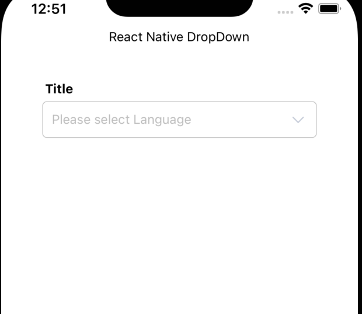
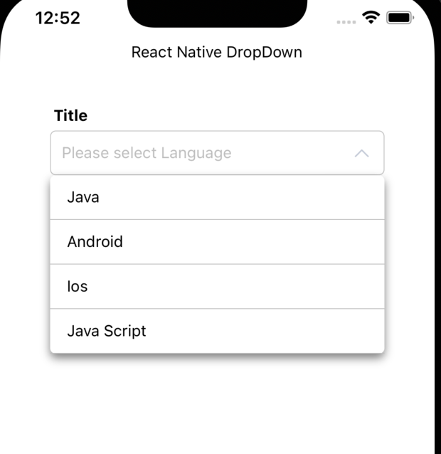

# react-native-dropdown-mith 
react-native-dropdown-mith is fully customize library , that is used both Platform Android and Ios.

# Getting started
```sh
 npm i react-native-drop-down-mith

 yarn add react-native-drop-down-mith
```
# Demo
 <p align="center">
  
</p>

# Properties

| containerStyle   | Style             | Main View                     |
| :-----:          | :---:             | :---:                         |
| dropDownStyle    | Style             | Listview Styles               |
| data             | []                | { id: number; value: string } |
| title            | String            | ""                            |
| titleStyle       | TextStyle         | Main title style              |
| placeHolder      | String            | ""                            |
| itemTextStyle    | TextStyle         | ""                            |
| selectedTextStyle| TextStyle         | ""                            |


```js
import React from 'react';
import {View, Text, SafeAreaView} from 'react-native';
import DropDown from 'react-native-drop-down-mith';

const Home = () => {
  return (
    <SafeAreaView style={{flex: 1}}>
      <View style={{width: '100%', height: '100%', paddingHorizontal: 10}}>
        <Text style={{alignSelf: 'center'}}>React Native DropDown</Text>
        <View
          style={{width: 300, height: 50, marginTop: 40, alignSelf: 'center'}}>
          <DropDown
            titleStyle={{marginBottom: 5, marginLeft: 3, fontWeight: 'bold'}}
            title="Title"
            onClick={item => console.log('------->', item)}
            placeHolder="Please select Language"
            data={[
              {id: 0, value: 'Java'},
              {id: 0, value: 'Android'},
              {id: 0, value: 'Ios'},
              {id: 0, value: 'Java Script'},
            ]}
          />
        </View>
      </View>
    </SafeAreaView>
  );
};
```